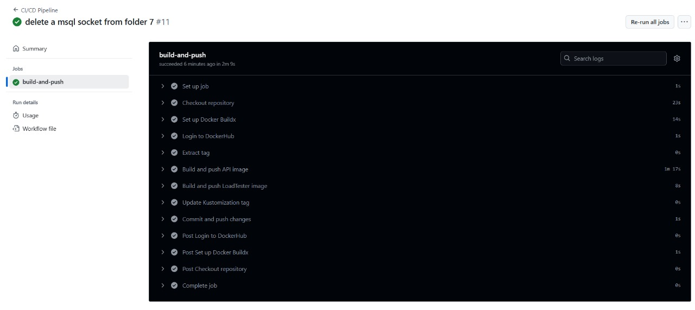
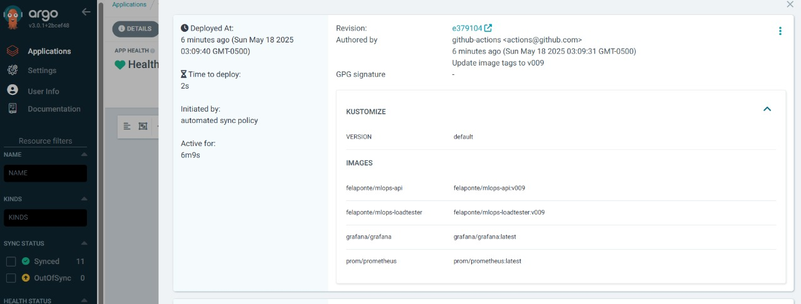
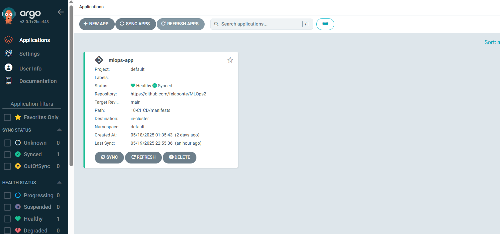
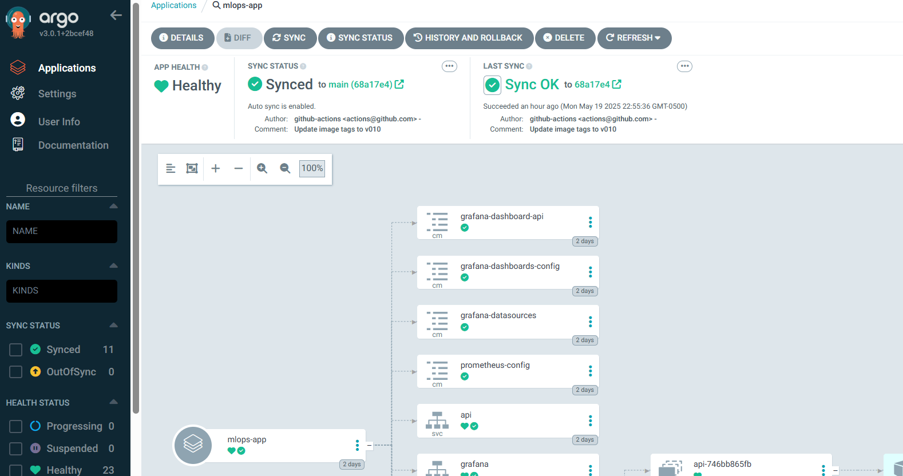
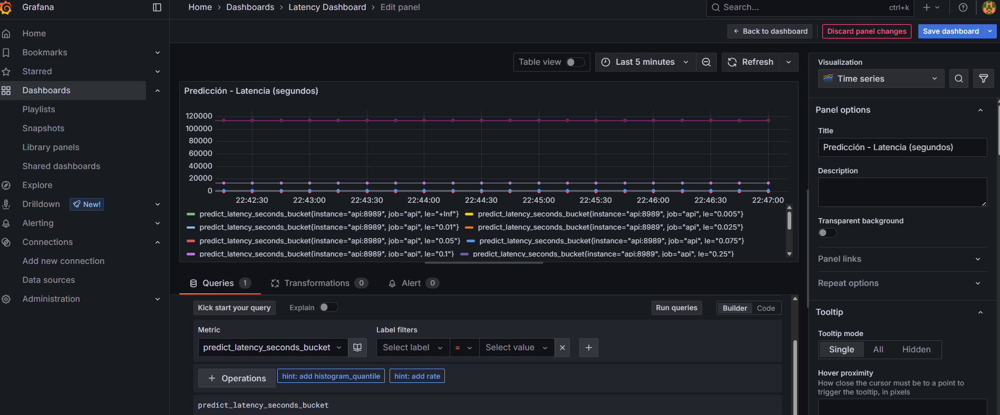
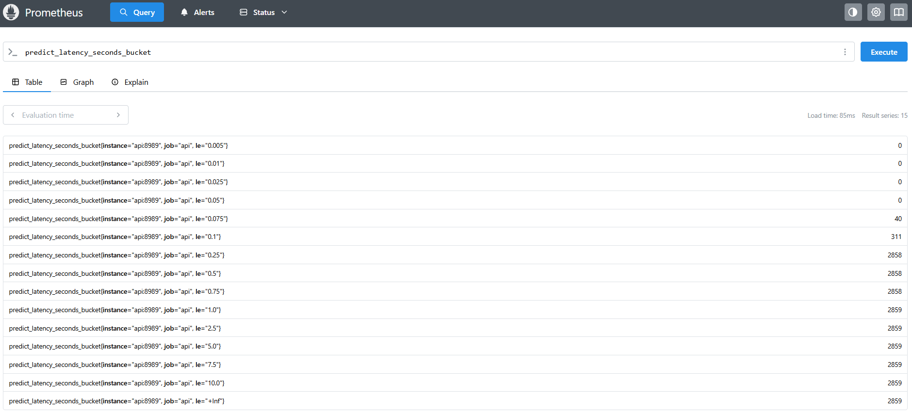

=======
# Taller: CI/CD y GitOps para despliegue de API de IA

## Objetivo del Taller

Diseñar e implementar una arquitectura **CI/CD con GitOps** para desplegar una API FastAPI con un modelo de IA, incluyendo observabilidad con **Prometheus** y **Grafana**, utilizando **GitHub Actions**, **Docker**, **Kubernetes** y **Argo CD**.

---
## Estructura del Proyecto

```
.github/workflows/ci-cd.yml
10-CI_CD/
├── api/
│ ├── app/                            # Código de la API FastAPI
│ │ ├── Dockerfile
│ │ ├── main.py
│ │ ├── model.pkl
│ │ └── requirements.txt
│ ├── train_model.py                  # Entrena y guarda model.pkl
│ ├── penguins_lter.csv               # Dataset
├── loadtester/                       # Script que hace carga a la API
│ ├── Dockerfile
│ ├── main.py
│ └── requirements.txt
├── manifests/                        # Manifiestos K8s para API, Loadtester, Prometheus y Grafana
│ ├── api-deployment.yaml
│ ├── api-service.yaml
│ ├── grafana-dashboard-api.yaml
│ ├── grafana-dashboards-config.yaml
│ ├── grafana-datasources.yaml 
│ ├── grafana-deployment.yaml 
│ ├── grafana-service.yaml 
│ ├── kustomization.yaml
│ ├── loadtester-deployment.yaml
│ ├── prometheus-configmap.yaml
│ ├── prometheus-deployment.yaml
│ └── prometheus-service.yaml 
├── argo-cd/                          # Configuración de Argo CD
│ ├── install-argocd.yaml
│ └── app.yaml
└── docker-compose.yaml               # (opcional para entorno local)
├── readme.md
```
---
## Componentes Implementados

* FastAPI: expone un endpoint `/predict` que utiliza `model.pkl` y otro `/metrics` con `prometheus_client`.

* LoadTester: envía peticiones periódicas al endpoint `/predict`.

* Prometheus: scrapea métricas desde `/metrics`.

* Grafana: visualiza métricas en dashboards configurados.

* GitHub Actions: Actualiza las imágenes en Dockerhub con tags como por ejemplo`v009`, y modifica el archivo kustomize para los manifiestos lean estas nuevas versiones, para finalmente realizar un push al main con los cambios.

* Argo CD: sincroniza automáticamente los manifiestos desde GitHub y actualiza el clúster de Kubernetes.
---
## Requisitos

- Fast Api
- Python 3.9
- Scikit-learn
- Kubernetes (en este caso se usó `microk8s`)
- Docker
- GitHub con acceso a Actions
- ArgoCD configurado y accesible (puerto 8080)

## Despliegue y Uso

A continuación, se describe el flujo completo de despliegue continuo (CI/CD) e infraestructura declarativa con GitOps (Argo CD).

### 1. Entrenamiento el modelo

- Se debe entrenar el modelo localmente con `train_model.py` y se guarda el archivo `model.pkl` que será usado por la API FastAPI para hacer inferencias en el endpoint /predict.

### 2. Construir y subir imágenes Docker

- Se generan las imágenes para subir a dockerhub para los servicios de la api y loadtester.

- Se ejecutan los manifiestos con kubernetes para los archivos se service, deployment y configmap para el api, loadtester, Prometheus(imagenes oficiales), Grafana(imagen oficial).

- Se instala ArgoCD en kubernetes y se genera el archivo .yaml para la aplicación en ArgoCD

- Se genera en la raíz el archivo .yml para ci-cd.yaml. Este va a ser leído por Github actions y se va a desencadenar cada que se realice un push a un tag nuevo. Este push a un nuevo tag desencadena lo siguiente:
   -    Actualizar en los pasos siguientes las imagenes en dockerhub con el tag nuevo
    - Actualiza los tags para las imagenes de la api y loadtester en el kustomization.yaml
    - Finalmente se realiza un último paso de un commit y un push con estos nuevos tags.

Todo esto se automatiza con GitHub Actions mediante la creación de un nuevo tag:

```
git tag v010
git push origin v010
```


### 3. Sincronización con ArgoCD

- ArgoCd se encuentra revisando cada nuevo push que se realice a la rama main en github. Por eso cuando GithubActions realiza el push, ArgoCD va actualizar los deployments para los servicios de kubernetes con estas nuevas imágenes identificadas con el nuevo tag.

```
sudo microk8s kubectl port-forward svc/argocd-server -n argocd 8080:443
```
- URL: http://localhost:8080
- Usuario: admin
- Contraseña:fFobCWw8vFNEGoC5

Si no se sabe, se obtiene con:

```
sudo microk8s kubectl get secret argocd-initial-admin-secret -n argocd -o jsonpath="{.data.password}" | base64 -d && echo
```




### 4. Visualización de métricas en Grafana y Prometheus

Grafana ya está configurado mediante ConfigMaps para conectarse a Prometheus.

Accede con:
```
sudo microk8s kubectl port-forward svc/grafana -n default 3000:3000
```
- Accede en: http://localhost:3000
- Podrás ver el dashboard con métricas como latencia y número de predicciones.



- Las métricas se obtienen desde Prometheus con la siguiente consulta:



### 5. Endpoints disponibles en la API

Una vez desplegada la API, se pueden consumir los siguientes endpoints:

- `POST /predict` para inferencia usando el modelo (model.pkl)
- `GET /metrics` para exponer métricas de Prometheus (predict_latency_seconds)
- `GET /` como endpoint de prueba.


### 6. Archivos clave de Kubernetes

La carpeta manifests/ contiene todos los manifiestos necesarios para desplegar los componentes:

- api-deployment.yaml, api-service.yaml para API FastAPI
- loadtester-deployment.yaml es la simulación de carga 
- prometheus-deployment.yaml, prometheus-configmap.yaml, prometheus-service.yaml para configurar Prometheus  
- grafana-deployment.yaml, grafana-datasources.yaml, grafana-dashboards-config.yaml, grafana-service.yaml para Visualización
- kustomization.yaml con los tags de imagen actualizados dinámicamente
- app.yaml para Argo CD

