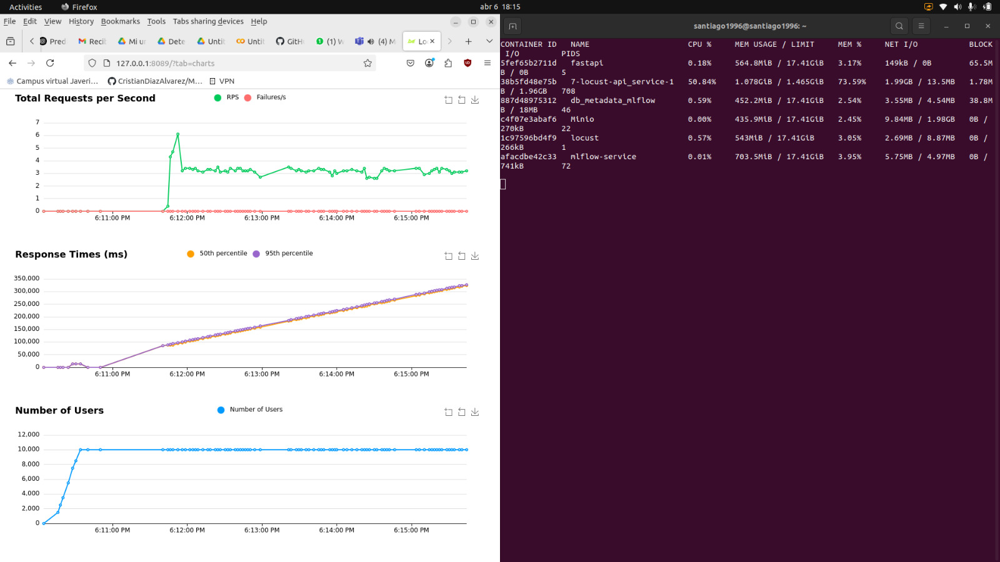

=======
### Taller de MLOps con Locust

Este taller consiste en realizar pruebas de carga con Locust sobre una API de inferencia desarrollada en FastAPI que sirve modelos registrados en MLflow. El objetivo es evaluar el rendimiento de la API bajo distintos escenarios de estrés, incrementando usuarios y réplicas.

## Estructura del Proyecto

```
7-Locust/
|
├── Airflow/                          # DAGs y configuración de Airflow
│   ├── dags/
│   │   └── dag-Proyecto2.py         # DAG para ingestión, entrenamiento y registro en MLflow
│   ├── Dockerfile                   # Imagen personalizada para Airflow con dependencias
│   └── requirements.txt            # Librerías requeridas por Airflow
│
├── api-data/                        # API que entrega datos desde CSV (usada por el DAG)
│   ├── data/
│   │   ├── covertype.csv
│   │   └── timestamps.json
│   ├── Dockerfile
│   ├── docker-compose.yaml
│   ├── main.py                      # API FastAPI para simular datos por lotes
│   ├── requirements.txt
│
├── api-inference/                   # API de inferencia que sirve modelos desde MLflow
│   ├── api.py
│   ├── Dockerfile
│   └── requirements.txt
│
├── locust/                          # Carpeta para pruebas de carga con Locust
│   ├── Dockerfile.locust
│   ├── locustfile.py               # Simulación de usuarios para el endpoint /predict
│   └── requirements-locust.txt
│
├── minio/                           # Carpeta para volumen persistente de MinIO
│   ├── .minio.sys/                 # Archivos internos de MinIO
│   └── mlflows3/                   # Bucket donde se almacenan los artefactos de modelos
│
├── mlflow/                          # Carpeta con configuración del servidor MLflow
│   ├── Dockerfile
│   ├── requirements.txt
│   ├── script.sh                   # Comando de arranque del servidor MLflow
│   └── metadata/                   # Volumen de base de datos MySQL usada por MLflow
│
├── docker-compose.yaml             # Orquestación general del proyecto (Airflow + MLflow + API)
├── docker-compose.locust.yaml      # Orquestación de pruebas de carga (API + Locust + MLflow)
├── readme.md

```
# Tecnologías Utilizadas

* Python 3.9

* FastAPI

* Scikit-learn

* MLflow

* Joblib

* Pandas y NumPy

* SQLAlchemy + PyMySQL

* Docker

* Docker Compose

* MinIO

* Locust

* UV
---
# Instrucciones para la ejecución

## 1. Clonar el Repositorio
Se clona el repositorio
```
git clone https://github.com/felaponte/MLOps2.git
cd MLOps2
cd 7-Locust
```
## 2. Creación de la Imagen y Cuenta en Docker Hub
Se crea una cuenta en Docker Hub. 


Luego se cosntruye y ejecuta la imagen de la API con docker-compose:
```
docker-compose -f docker-compose.yaml up --build -d
```
Lo anterior inicia los servicios de MLflow, Minio, MySQL, y la API de inferencia.

## 3. Publicación de la Imagen en Docker Hub

Después de autenticarse, se sube la imagen:

```
docker push s4g0/locust_pruebas:inference
```
##  4. Uso de la Imagen Publicada

Se ejecuta el Docker Compose con la imagen previamente cargada y se llama directamente la imagen de Docker Hub.

```
version: '3.8'
services:
  api-inferencia:
    image: s4g0/locust_pruebas:inference
    ports:
      - "8989:8989"
    restart: always
```

##  5. Entrenar y registrar modelos usando el DAG de Airflow

Activar manualmente el DAG llamado Pipeline-proyecto2 desde la interfaz de Airflow en: http://localhost:8080.

## 6. Probar la API de Inferencia
Acceder a la API de inferencia en: http://localhost:8989/docs

Ahí se prueba el endpoint /predict.

## 7. Ejecutar pruebas de carga con Locust
```
docker-compose -f docker-compose.locust.yaml up --build
```
Acceder a la interfaz web de Locust en: http://localhost:8089

Ahí se configura el número de usuarios y la tasa de llegada (spawn rate).

## 8. Asignación de Recursos y Escalamiento
Configuración inicial utilizada en el servicio api_service:

```
resources:
  limits:
    cpus: '1'
    memory: 1500M
  reservations:
    cpus: '0.25'
    memory: 200M
```

## 10. Resultados de las pruebas

A continuación se muestran los resultados visuales obtenidos con diferentes configuraciones de recursos y réplicas:

# Prueba 1: 1 réplica – 500MB memoria – 1 CPU


#  Prueba 2: 1 réplica – 1.5GB memoria – 1 CPU


# Prueba 3: 2 réplicas – 1.5GB c/u


# Prueba 4: 4 réplicas


# Prueba 5: 6 réplicas – carga estable




Resumen Final


## 9. Análisis de comportamiento

* 1 replica / 1cpu / memoria 500MB

Debido a la cantidad de peticiones, el servicio se cae. Esto es por la cantidad de memoria ram, esta es tan pequeña que no hay espacio suficiente para recibir más peticiones y colapsa, pero se reinicia y comienza a recibir de nuevo y luego vuelve y colapsa. Las request estaba alrededor de 7 por segundo

* 1 replica / 1cpu / 1.5GB

El servicio continúa en funcionamiento ya que tiene la memoria suficiente para recibir las request, pero estas van quedando en cola y los tiempos de respuesta van aumentando constantemente. Las request estaba alrededor de 7 por segundo

* 1 replica / 0.5cpu / 1.5GB

Las request bajaron entre 3 y 4 segundos, esto se debe a la mitad de la CPU usada, pero el servicio continúa funcionando ya que la memoria ram es suficiente. Los valores de la ram usada llegan a valores entre 1 y 1.2 GB

* 1 replica / 6cpu / 6GB

Se puede observar que sigue teniendo los mismos valores anteriores de request por segundo sin caerse el servicio, pero no mejora en tiempos de respuesta y se siguen encolando los servicios. La memoria sigue manteniéndose en máximo 1.2GB mirando las stats de Docker y alrededor de 105% en la CPU. Por este motivo encontramos que los recursos óptimos en una replica serían 1CPU y 1.5GB de RAM.

* 2 replicas / 1 CPU / 1.5GB

Se puede observar que los request por segundo aumentaron al doble, alrededor de 12 por segundo. Esto tiene sentido al aumentar a dos replicas con las condiciones óptimas encontradas en 1 sola replica. También se puede observar que debido a que se tienen dos replicas las request encoladas se dividen en dos servicios y por tal motivo la memoria requerida para soportar esto en cada servicio ha bajado a alrededor de 800 a 900MB.

* 3 replicas / 1CPU / 1.5GB

Se observa que los request por segundo aumentaron a 15-17. Esto también refleja una encolada de los servicios más lenta, es decir, los tiempos de respuesta se fueron aumentando, pero de manera mas lenta y no tan exponencial como antes. Adicionalmente la memoria requerida ha seguido bajando alrededor de 700MB

* 4 replicas / 1CPU / 1.5 GB

Como con 2 y 3 replicas los request por segundo aumentaron, esta vez alrededor de 19-21. En cuanto a los tiempos de respuesta, se han seguido encolando las request y sigue el tiempo en aumento, pero no tan rápido como con menos replicas. 

* 6 replicas / 1CPU / 1.5GB

Siguió en aumento los request por segundo pero ya no de manera lineal, esta vez ha subido alrededor de 22-23. La memoria en uso también disminuyo pero esta vez se encuentra alrededor de  600MB
