<<<<<<< HEAD

=======
### Proyecto 2: MLOps

Este proyecto tiene como objetivo implementar una solución completa de MLOps para predecir el tipo de cubierta forestal utilizando datos geoespaciales. Se integran herramientas como Airflow, MLflow, FastAPI, MinIO, MySQL.

El pipeline realiza:

* Ingesta de datos.

* Entrenamiento de modelos.

* Registro y seguimiento en MLflow.

* Pruebas de inferencia vía API.

Dataset: CoverType de UCI (versión simplificada).

## Estructura del Proyecto

```
Proyecto2/
│── docker-compose.yaml        # Archivo de docker compose
│── Readme.md                  # Documentación del proyecto
│── Airflow/                   
│──── dags/
|────── dag-proyecto2.py                
│──── logs/                    # Carpeta donde se van a guardar los logs generados por los Dags de Airflow
│──── plugins/                 # Carpeta de plugins de Airflow
│──── requirements.txt         # Dependencias necesarias para la Airflow
│──── Dockerfile               # Dockerfile para construir el contenedor de Airflow
│── mlflow/                    # Carpeta con los archivos del servicio de ML
│──── Dockerfile               # Dockerfile para construir el contenedor de MLflow
│──── requirements.txt         # Dependencias necesarias para el modelo de ML
│──── script.sh                # Comandos para levantar el servicio de MLflow
│── api-data/                  # Carpeta clonada del profesor para hacer la conexión a la Api que genra los archivos raw
│── api-inference/             # Carpeta con los docuemtnos apra genrar la Api de inferencia
│──── api.py                   # Código python para generar la api de inferencia a partir de los modelos de producción MLflow
│──── requirements.txt         # Dependencias necesarias
│──── Dockerfile               # Dockerfile para construir el contenedor de la Api de inferencia a partir de FastApi.
│── minio/                     # Volumen donde estará el bucket de S3 para guardar los artifacts de Mlflow
```
# Tecnologías Utilizadas

- Python 3.9
- FastAPI
- Scikit-Learn
- Joblib
- Pandas & NumPy
- Docker
- UV
- MySQL
- Airflow
- MLflow
- Minio

---
# Instrucciones

## 1. Clonar el Repositorio
Se clona el repositorio
```
git clone https://github.com/felaponte/MLOps2.git
cd MLOps2
cd Proyecto2
```
## 2. Declarar variables de entorno para que funcione Airflow

Ejecutar en terminal:

```
echo -e "AIRFLOW_UID=$(id -u)" > .env
echo -e "AIRFLOW_PROJ_DIR=./Airflow" >> .env
```

## 3. Construir y levantar los servicios

```
docker compose up --build
```
Esto desplegará los siguientes servicios:

Airflow (puerto:8080)
MLflow (puerto:5000)
MinIO (puerto:9001)
FastAPI de inferencia (puerto:8989)

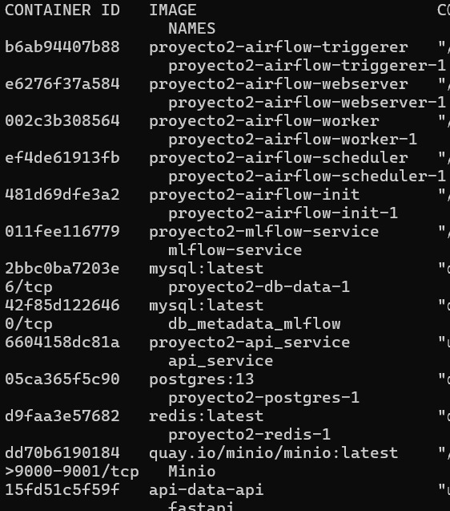

## 4. Iniciar Sesión y crear bucket en Minio:

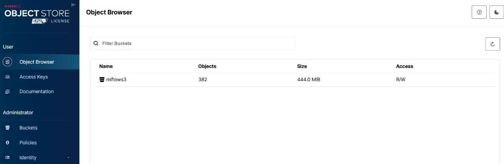

Se creo un Bucket llamado mlflows3

## 5. Ejecutar DAG desde la UI de Airflow

Decidimos guardar los datos en una base de datos relacional de MySQL.

Como primer task en el Dag garantizamso que la base de datos este vacía. Como se muestra a continuación:


La segunda Task es la ingesta de datos donde nos conectamso a la api donde están disponibles los datos. De forma predeterminada cada batch de la api de los datos se actualizaba cada 5 min, pero lo cambiamos a 5 segundos para mayor rapidez. Y esta segunda task lo que hace es conectarse a esta api cada 3 segundos para intentar tomar un batch de datos nuevo.  Finalmente, después de tomar los 10 batch hacemos la ingesta de datos sin procesar a nuestra base en MySQL.

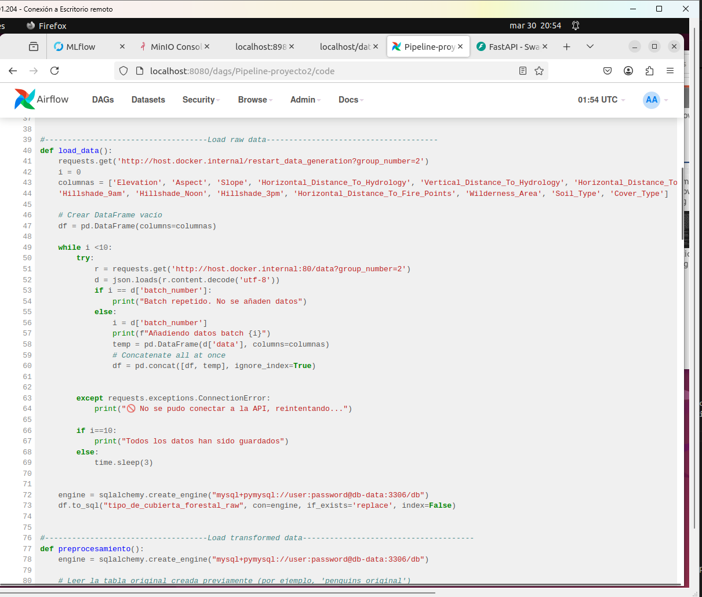

La tercera task hacemos el preprocesamiento de los datos y generamos los datos de entrenamiento y test.

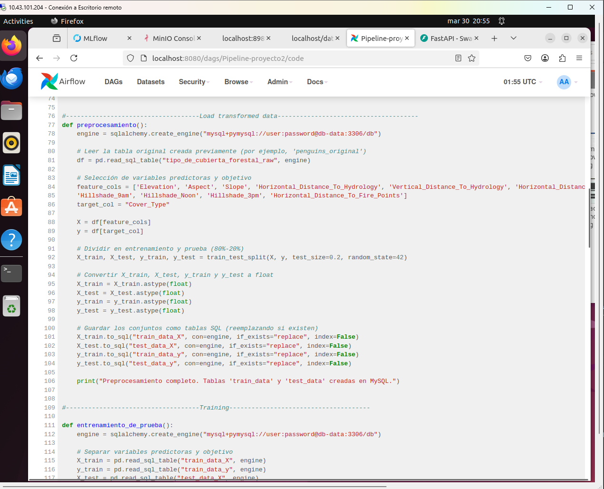


La cuarta, quinta y sexta Task es donde se realiza el entrenamiento de los modelos y el registro de las métricas en MLflow.

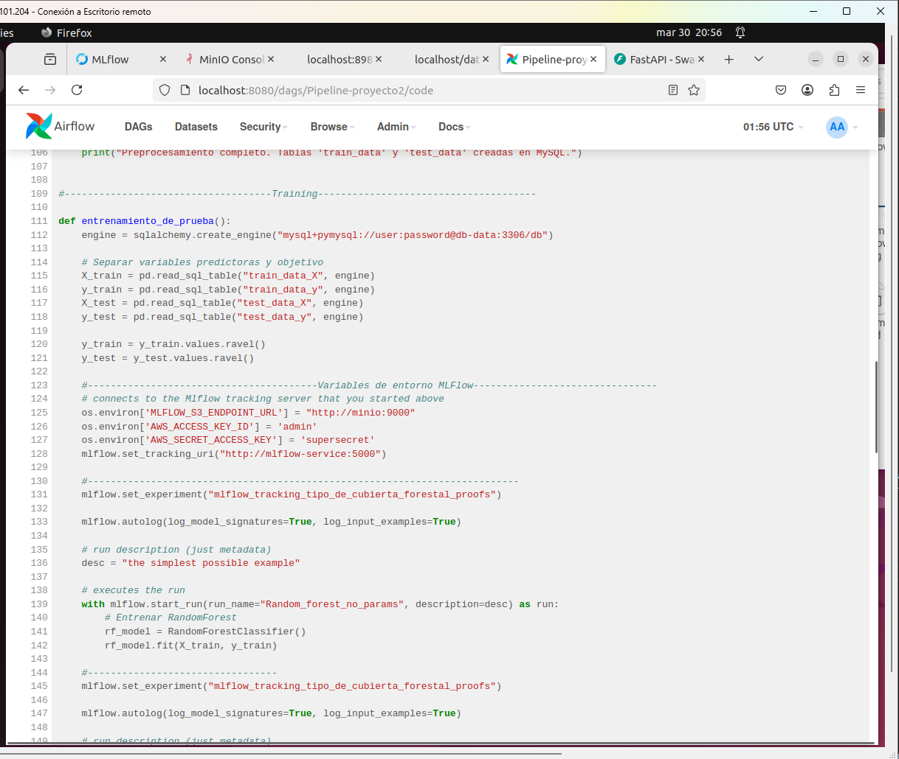

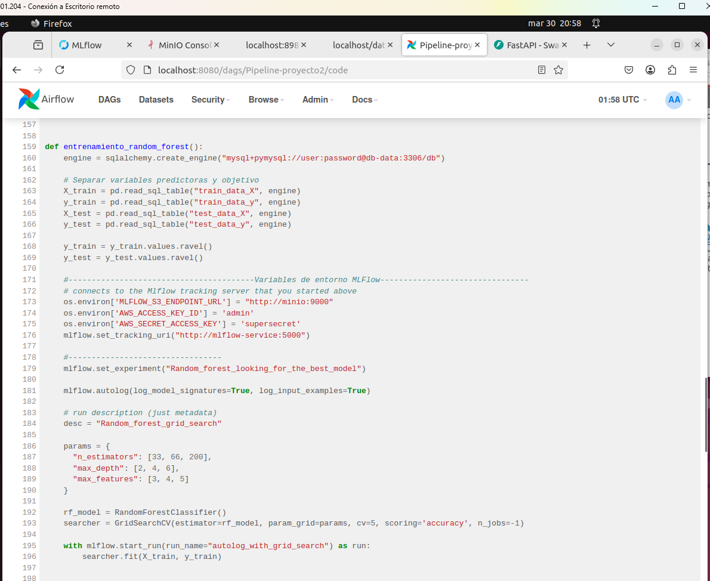

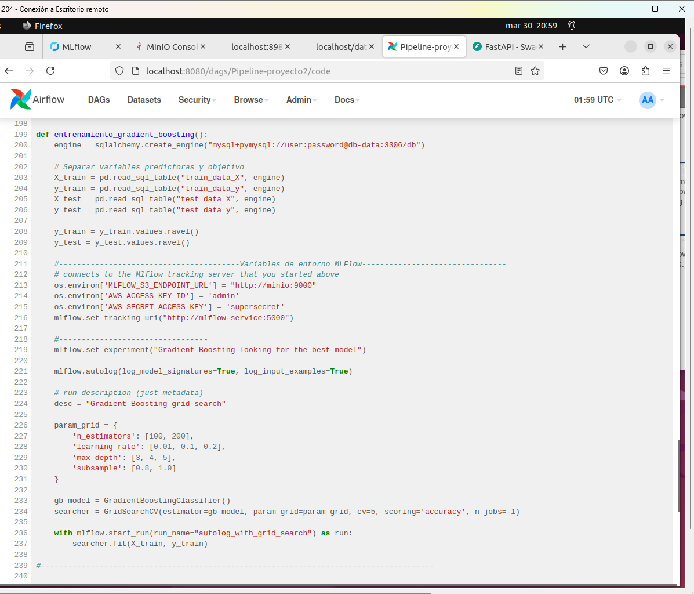

Finalmente, ejecutamos el DAG y esperamos a que termine la ejecución (El task train_gradient_boosting se demoró tres horas en terminar)

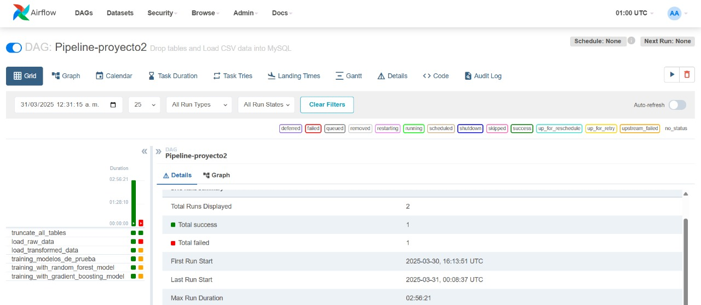

## 6. Revisión de experimentos y registro de modelos en MLFlow

Se revisar los modelos y experimentos realizados por el DAG en Airflow.

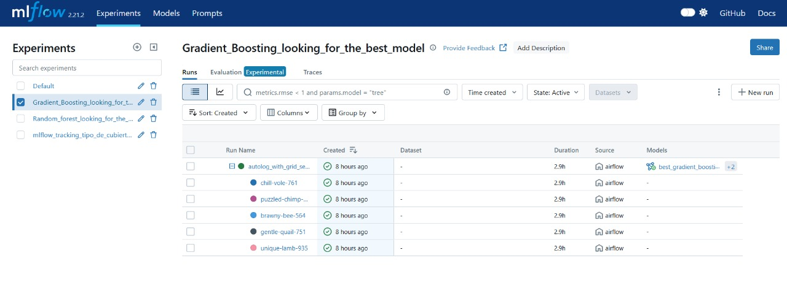

Se registran los mejores modelos para random forest y gradient boosting. Se debe etiquetar como "production" para que la API los pueda cargar

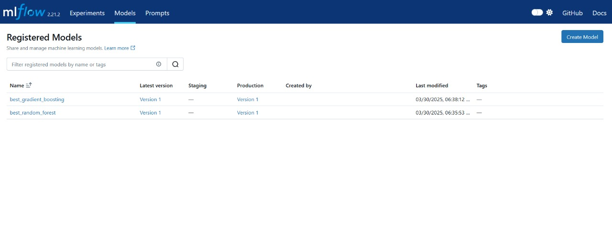

## 7. Ejecución del servicio de API

En la Api se ven los modelos que pusimos en producción usando MLflow.

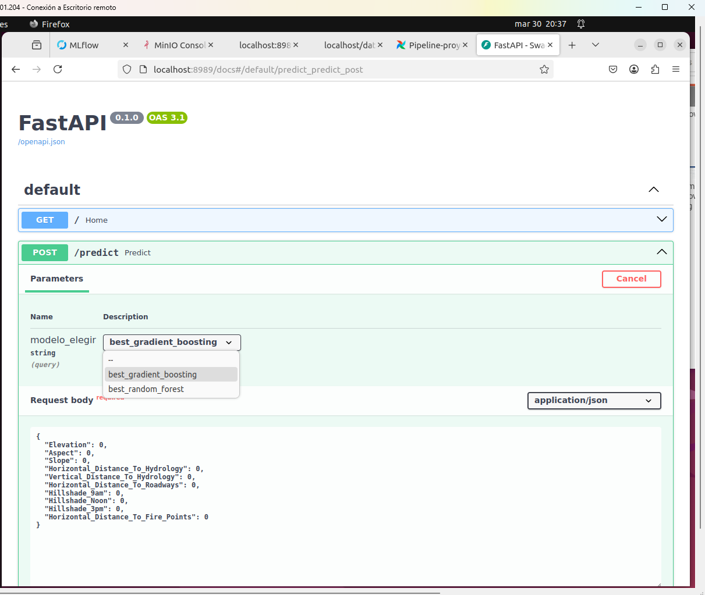

Luego, se prueba que los modelos que se pusieron en producción realizan correctamente la inferencia.

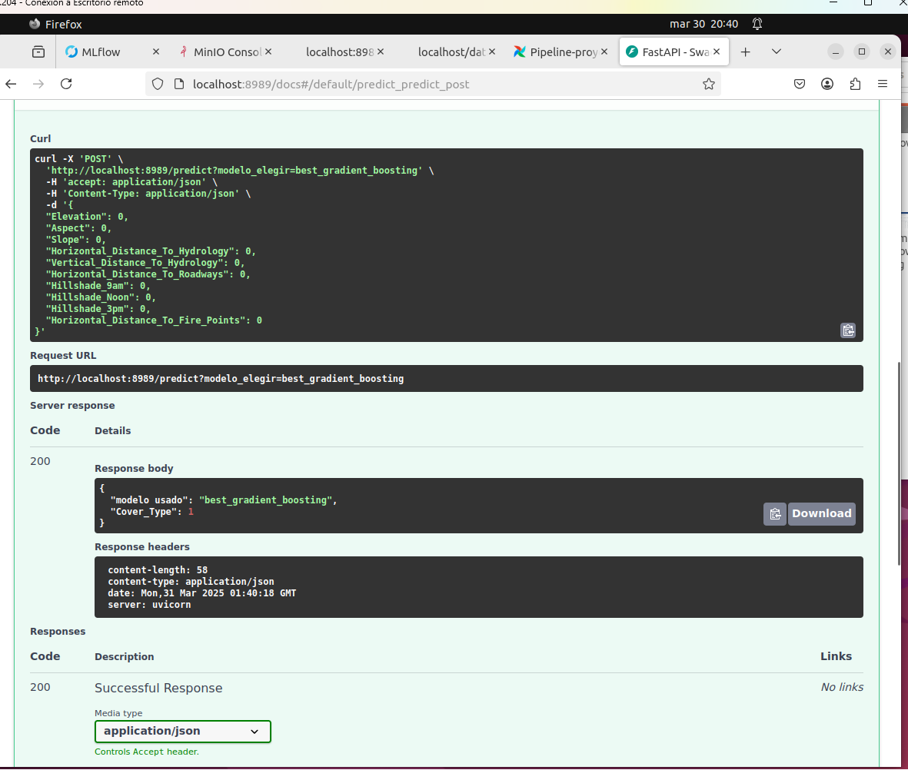


