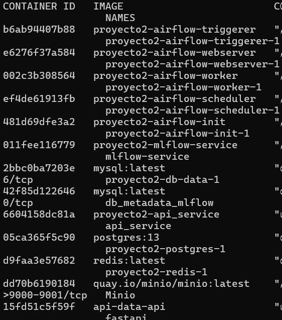

<<<<<<< HEAD

=======
### Proyecto 2: MLOps

Este proyecto tiene como objetivo implementar una solución completa de MLOps para predecir el tipo de cubierta forestal utilizando datos geoespaciales. Se integran herramientas como Airflow, MLflow, FastAPI, MinIO, MySQL.

El pipeline realiza:

* Ingesta de datos.

* Entrenamiento de modelos.

* Registro y seguimiento en MLflow.

* Pruebas de inferencia vía API.

Dataset: CoverType de UCI (versión simplificada).

## Estructura del Proyecto

```
Proyecto2/
│── docker-compose.yaml        # Archivo de docker compose
│── Readme.md                  # Documentación del proyecto
│── Airflow/                   
│──── dags/
|────── dag-proyecto2.py                
│──── logs/                    # Carpeta donde se van a guardar los logs generados por los Dags de Airflow
│──── plugins/                 # Carpeta de plugins de Airflow
│──── requirements.txt         # Dependencias necesarias para la Airflow
│──── Dockerfile               # Dockerfile para construir el contenedor de Airflow
│── mlflow/                    # Carpeta con los archivos del servicio de ML
│──── Dockerfile               # Dockerfile para construir el contenedor de MLflow
│──── requirements.txt         # Dependencias necesarias para el modelo de ML
│──── script.sh                # Comandos para levantar el servicio de MLflow
│── api-data/                  # Carpeta clonada del profesor para hacer la conexión a la Api que genra los archivos raw
│── api-inference/             # Carpeta con los docuemtnos apra genrar la Api de inferencia
│──── api.py                   # Código python para generar la api de inferencia a partir de los modelos de producción MLflow
│──── requirements.txt         # Dependencias necesarias
│──── Dockerfile               # Dockerfile para construir el contenedor de la Api de inferencia a partir de FastApi.
│── minio/                     # Volumen donde estará el bucket de S3 para guardar los artifacts de Mlflow
```
# Tecnologías Utilizadas

- Python 3.9
- FastAPI
- Scikit-Learn
- Joblib
- Pandas & NumPy
- Docker
- UV
- MySQL
- Airflow
- MLflow
- Minio

---
# Instrucciones

## 1. Clonar el Repositorio
Se clona el repositorio
```
git clone https://github.com/felaponte/MLOps2.git
cd MLOps2
cd Proyecto2
```
## 2. Construir y levantar lso servicios

```
docker compose up --build
```
Esto desplegará los siguientes servicios:



## 3. Ejecución servicio de API
Se inicia el servicio que nos va a permitir usar la API
```
sudo docker compose up --build ml_service
```
Este servicio va a desplegar la API en el puerto 8989 donde vamos a poder hacer la inferencia con los modelos entrenados del paso anterior.
Esta API reconoce los archivos .pkl que fueron entrenados anteriormente. Si se hubiesen entrenados más modelos la API está en la capacidad de reconocerlos.
Esta API es necesario escoger el modelo a usar y pasarle los parámetros "Culmen_Length_mm", "Culmen_Depth_mm", "Flipper_Length_mm" para poder realizar la inferencia.


